# 🛡️ DeadlineGuardian — Cognitive Threat Console for Overcoming Procrastination

Welcome to **DeadlineGuardian** (internally styled as *Guardian Threat Console*), an immersive, high-fidelity cognitive workstation designed to combat chronic academic and professional procrastination. 

By re-framing task deadlines as live "system threats" within a beautifully stylized, high-contrast dashboard, DeadlineGuardian leverages behavioral psychology, predictive risk metrics, real-time in-app multi-stage notifications, and interactive AI coaching to keep users disciplined and focused.

---

## 📋 Table of Contents
1. [Problem Statement Selected](#1-problem-statement-selected)
2. [Solution Overview](#2-solution-overview)
3. [Key Features](#3-key-features)
4. [System Architecture & Visual Workflows](#4-system-architecture--visual-workflows)
5. [Google Technologies Utilized](#5-google-technologies-utilized)
6. [Other Technologies Used](#6-other-technologies-used)
7. [Installation & Setup](#7-installation--setup)

---

## 1. Problem Statement Selected

### **The Cognitive Battle of Procrastination & Hyperbolic Discounting**
Procrastination is rarely a time-management problem; it is an **emotional regulation and cognitive bias problem**. Humans suffer from *hyperbolic discounting*—the tendency to prioritize immediate, smaller rewards (e.g., browsing social media) over larger, delayed rewards (e.g., completing an assignment due in a week). 

Traditional to-do list applications fail because:
* **Passive Notification Slop:** They send standard, boring notifications that are easily swiped away or ignored.
* **Lack of Urgency Reframing:** They list tasks in flat, list-based grids, failing to communicate the temporal distance of deadlines visually.
* **Inflexible Task Structuring:** They do not account for a student's daily cognitive and energetic fluctuations (e.g., morning vs. evening energy peaks).
* **Friction in Task Creation:** Complex sign-ups and multi-step forms create immediate cognitive friction, causing the procrastinator to abandon the tool before writing down a single task.

---

## 2. Solution Overview

**DeadlineGuardian** acts as a "Threat Console" for your personal commitments. It removes all initial friction by dropping users directly into an instant, high-performance workstation (guest-scout mode) without forced signup forms, while maintaining real-time durability through locally persistent states or synchronized Firestore databases.

```
+--------------------------------------------------------------------------+
|                        DEADLINEGUARDIAN ENGINE                           |
|                                                                          |
|   [Task Creation] -----> [Adaptive Scheduler] -----> [Predictive Risk]    |
|   (Natural Language)      (Circadian Peak Alignment)  (Threat Assessment) |
|                                                                          |
|          +---------------------+---------------------+                   |
|          |                     |                     |                   |
|          v                     v                     v                   |
|    [Threat Grid]         [AI Motivation]       [2x Alert Pipeline]       |
|   (Visual Urgency)      (Gentle/Strict/Stoic)   (Custom T-Minus Alarms)  |
+--------------------------------------------------------------------------+
```

### **Core Pillars of the Solution:**
1. **The Interactive Threat Grid (Desktop-First Visuals):** Instead of static checkmarks, tasks are treated as visual components. High-priority items glow with subtle warning indicators, and tasks that are nearing expiration show live countdown timers and calculated hourly requirements.
2. **Double-Alarm Buffer Pipeline (2x Alerts):** To eliminate the "I forgot" excuse, users can configure **two distinct custom warnings prior to a task's deadline** (e.g., 60 minutes and 15 minutes prior). These alerts trigger dynamically, and appear directly inside a central Reminders Console.
3. **Circadian Rhythm & Energy Alignment:** During onboarding, users select their energy profiles (e.g., Morning Bird vs. Night Owl) and target daily study limits. Tasks are then evaluated against their current energetic state, guiding them to do heavy lifting during peak productivity windows.
4. **Interactive AI Coaching (Gemini & LLMs):** Features a dedicated motivational coach equipped with custom personas:
   * *Gentle:* Encouraging, warm, and supportive.
   * *Strict:* Direct, highly military, and urgency-focused.
   * *Stoic:* Philosophical, focused on voluntary discomfort and duty.

---

## 3. Key Features

* **Instant Workstation Access:** No mandatory email verification blocks. The app securely starts in a zero-friction guest container, using high-speed local persistence while fully integrating Firestore for real-time backup if database parameters are loaded.
* **Dual-Stage In-App Alerts:** Custom time offset fields in the settings menu let users define exactly when they receive their first and second "T-Minus" reminders before a deadline.
* **Simple, One-Line Upcoming Carousel:** An elegant, single-line marquee banner anchors the top of the workstation, displaying active upcoming tasks in order of urgency with highly compact countdowns (e.g., `(in 4h)`, `(tomorrow)`).
* **Cognitive Focus Mode Panel:** Includes modular workspaces, custom breathing timers, and ambient task shields to maximize deep-work retention.
* **Gamification & Ranks:** Completing tasks yields experience points (XP) that level up the user's "Guardian Rank," providing an immediate neurological reward loop.

---

## 4. System Architecture & Visual Workflows

### **A. User Journey & Core Application Flow**

Below is a detailed sequence diagram showing how a task is created, analyzed for threat level, aligned with the user's circadian rhythm, and automatically monitored for dual-stage alerts:

```mermaid
sequenceDiagram
    autonumber
    actor User as Guardian Scout
    participant App as DeadlineGuardian UI
    participant AI as Gemini API Engine
    participant DB as Firestore & Local Cache

    User->>App: Submits raw task (e.g., "History essay due 8 PM")
    Note over App: App strips metadata,<br/>parses date, and assigns threat level
    App->>DB: Persists Task State
    App->>App: Calculates Time Remaining
    App->>App: Renders task in the Single-Line Upcoming Carousel
    
    rect rgb(20, 20, 25)
        Note over App: Real-Time Monitoring Loop (Every 30 Seconds)
        loop Background Check
            App->>App: Check T-Minus offset 1 (e.g., 60 mins remaining)
            alt Deadline == Offset 1
                App->>App: Push 1st Reminder to Reminders Dashboard
                App->>User: Display Yellow Flashing Indicator (T-60m)
            end
            
            App->>App: Check T-Minus offset 2 (e.g., 15 mins remaining)
            alt Deadline == Offset 2
                App->>App: Push 2nd Urgent Reminder to Reminders Dashboard
                App->>User: Play Focus Alarm & Flash Red Border (T-15m)
            end
        end
    end

    User->>App: Clicks "Ask AI Companion" for motivation
    App->>AI: Fetch advice using selected profile (Strict/Stoic/Gentle)
    AI-->>App: Returns custom motivational response
    App-->>User: Renders advice via the Anime Companion bubble
```



### **B. Data Management & Sync Architecture**

Our storage layer operates as an **offline-first hybrid engine**, giving the client immediate, zero-latency access while syncing securely to the cloud.

```
                     +----------------------------+
                     |        User Device         |
                     +----------------------------+
                                   |
              +--------------------+--------------------+
              |                                         |
              v                                         v
     [LocalStorage Cache]                     [React State Controllers]
  - Cached Tasks & Settings                 - State tracking (tasks, settings)
  - Gamification (XP, Ranks)                 - Real-time deadline timers
              |                                         |
              +--------------------+--------------------+
                                   |
                                   v  (Bi-directional Sync)
                     +----------------------------+
                     |    Firebase Firestore DB   |
                     |  - collections: users/     |
                     |  - subcol: tasks, configs  |
                     +----------------------------+
```

---

## 5. Google Technologies Utilized

Google's robust web ecosystem powers the core features of **DeadlineGuardian**:

| Technology | Role within the Application | Implementation Details |
| :--- | :--- | :--- |
| **Google AI Studio** | Integrated Prompt Prototyping & Development | Used to build, refine, and stress-test the custom behavioral system prompts that feed our conversational AI companion. |
| **Gemini API** | Advanced Generative Coaching & Cognitive Re-framing | Leverages server-side endpoints with the modern `@google/genai` TypeScript SDK to deliver real-time, context-aware advice depending on the user's chosen coaching persona (Gentle, Strict, Stoic). |
| **Firebase Auth** | Lightweight User Identity System | Manages secure, authenticated sessions where needed. Built with native fallback support for local anonymous operations to ensure zero user onboarding friction. |
| **Firebase Firestore** | Real-Time, Event-Driven Document Database | Stores user profile settings, custom task objects, and notification logs. Implemented using sub-collections under `users/{uid}/` with active `onSnapshot` subscriptions for real-time reactivity across multiple tabs or devices. |

---

## 6. Other Technologies Used

In addition to Google's primary cloud offerings, several other leading industry technologies were utilized to polish, design, and structure the applet:

* **Claude & ChatGPT:** Employed extensively during the rapid design prototyping phase to optimize structural CSS classes, build specialized animations, and format the adaptive circadian energy formulas.
* **Supabase:** Integrated as an optional, secondary PostgreSQL relational client to handle complex high-dimensional relational queries, user tracking data structures, and database schema models.
* **React 18 & Vite:** The backbone of the Single Page Application (SPA), delivering ultra-fast hot module compiling and responsive performance.
* **Tailwind CSS:** Used exclusively for high-contrast, eye-safe styling, dark-theme panels, and responsive grid system adaptation across desktop, tablet, and mobile screens.
* **Motion (Framer Motion):** Standard layout transition engine, used to handle smooth layout entries, card removal fadeouts, and notification slide-ins.
* **Lucide React:** Used for beautiful, modern, pixel-perfect UI icons throughout the navigation and configuration menus.

---

## 7. Installation, Setup & Git Synchronization

### **1. Git Repository & Sync Configuration**
To synchronize or push changes from this workstation to your remote GitHub repository, configure your git origin:
```bash
# Initialize git if not already done
git init

# Add the remote target origin
git remote add origin https://github.com/Anshika-1710/guardian-ai.git

# Set active branch
git branch -M main

# Push project files to your repository
git add .
git commit -m "feat: integrate deadline threat console and project workflow maps"
git push -u origin main
```

### **2. Prerequisites**
* Node.js v18 or higher
* npm or yarn

### **3. Install Dependencies**
```bash
npm install
```

### **4. Configure Environment Variables**
Create a `.env` file in the root directory:
```env
GEMINI_API_KEY="your_google_gemini_api_key_here"
```

### **5. Start the Development Server**
```bash
npm run dev
```
The server will start on port `3000`. Open your browser and navigate to `http://localhost:3000` to access your local cognitive Threat Console!

---

*This Project documentation is prepared and structured for easy sharing, submission, and review.*
